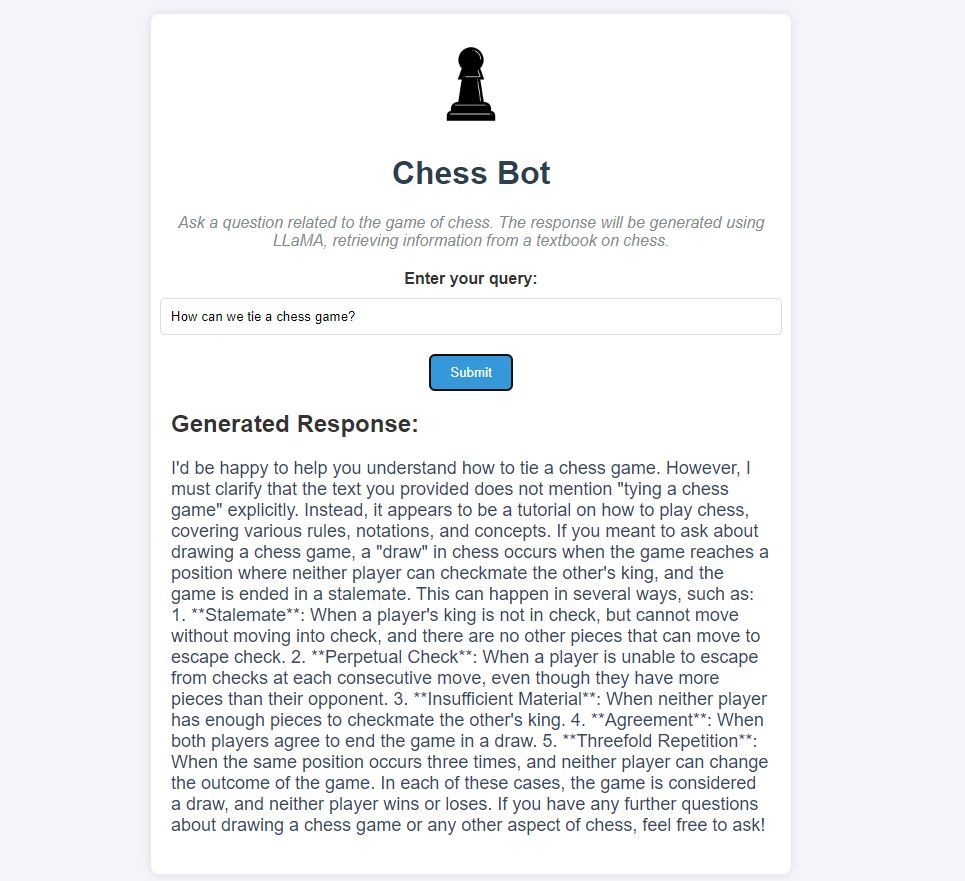

# Chess Bot Application

This is a Chess Bot application that uses a combination of natural language processing models, including DistilBERT for embeddings and LLaMA 3 for text generation, to answer chess-related questions. The bot retrieves relevant information from a PDF textbook on chess, chunks the text, retrieves the most relevant pieces using FAISS, and generates a response using the LLaMA 3 model through AWS Bedrock.



## Features

- **Text Extraction**: Extracts text from a chess textbook in PDF format.
- **Text Chunking**: Splits the extracted text into manageable chunks for processing.
- **FAISS Indexing**: Retrieves top-k relevant document chunks based on query embeddings.
- **LLaMA 3 Integration**: Uses LLaMA 3 to generate responses to chess-related queries.
- **Flask Frontend**: A simple web-based frontend where users can input chess queries and receive responses.

## How It Works

1. Extracts text from a chess PDF textbook using PyPDF2.
2. Chunks the text into smaller segments to work within model constraints.
3. Generates embeddings for the text chunks using DistilBERT.
4. Stores embeddings in a FAISS index to enable fast similarity search.
5. Retrieves the top-k similar chunks based on the user’s query.
6. Calls the LLaMA 3 model via AWS Bedrock to generate a detailed response based on the query and retrieved context.

## Technologies Used

- **Flask**: Web framework to serve the app.
- **DistilBERT**: For generating embeddings.
- **LLaMA 3**: For generating detailed text responses via AWS Bedrock.
- **FAISS**: For efficient similarity search and retrieval.
- **AWS Bedrock**: For hosting and invoking the LLaMA 3 model.
- **Docker**: Containerization for easy deployment.

## Setup Instructions

### 1. Clone the Repository

```bash
git clone https://github.com/siddharth130500/RAG_chess_bot.git
cd chess-bot
```

### 2. Install Dependencies

Ensure you have Python 3.10 or later installed. Install the required Python dependencies:
```bash
pip install -r requirements.txt
```

### 3. Set Up Environment Variables

The application requires AWS credentials to interact with the LLaMA 3 model via AWS Bedrock. Create a .env file in the root directory of the project with the following:
```bash
AWS_ACCESS_KEY_ID=your_access_key_id
AWS_SECRET_ACCESS_KEY=your_secret_access_key
```

### 4. Run the Application

Start the Flask server locally:
```bash
python app.py
```
The application will be accessible at http://localhost:5000.

### 5. Docker Setup

The Docker image for the Chess Bot application is available on DockerHub.
#### DockerHub Image
You can pull the pre-built Docker image from DockerHub:
```bash
docker pull siddharth130500/chess-bot-app:latest
```

#### Run the Docker Container
Ensure that your .env file is mapped into the Docker container for AWS authentication:
```bash
docker run -d -p 5000:5000 -v /path/to/your/.env:/app/.env siddharth130500/chess-bot-app
```

### 6. Usage

1. Open a web browser and go to http://localhost:5000.
2. Enter a chess-related question in the input field.
3. Submit the query and wait for the response generated by the LLaMA 3 model.

# Automated start and stop for the Docker container

For automated container start and stop mechanisms to optimize resource usage, we can use a CGI-based interface to start the container on demand and monitor for inactivity to stop the container automatically.

## Features

- **Automated Start**: The container starts automatically when accessed through a browser via a CGI script.
- **Inactivity Monitoring**: A script monitors for inactivity and stops the container after a defined timeout period.
- **Nginx Reverse Proxy**: Nginx is configured as a reverse proxy to route requests seamlessly to the application.

---

## File Overview

### 1. `start_docker_container.sh`
- **Purpose**: Starts the Docker container if not already running.
- **Key Features**:
  - Checks the status of the container using its name (`siddharth130500/chess-bot-app`).
  - Starts the container on port `5000` and mounts the `.env` file.
  - Sets up a cron job to monitor inactivity using `timeout_check.sh`.
- **Usage**: Automatically triggered by `start_container.cgi`.

### 2. `timeout_check.sh`
- **Purpose**: Stops the Docker container after a specified period of inactivity.
- **Key Features**:
  - Monitors `/var/log/nginx/access.log` for the last access timestamp.
  - Compares the last access time to the current time and stops the container if inactivity exceeds `120 seconds`.
  - Removes the associated cron job upon stopping the container.
- **Usage**: Triggered by the cron job set in `start_docker_container.sh`.

### 3. `start_container.cgi`
- **Purpose**: A CGI script to start the container when accessed via the browser.
- **Key Features**:
  - Executes `start_docker_container.sh`.
  - Displays a confirmation message and redirects to the application (`http://localhost:5000/`) after a short delay.
- **Usage**: Access via the URL `http://localhost/cgi-bin/start_container.cgi`.

### 4. `test.cgi`
- **Purpose**: A test CGI script to verify CGI execution.
- **Key Features**:
  - Outputs a test message (`Test CGI Script Works`) in the browser.
- **Usage**: Access via the URL `http://localhost/cgi-bin/test.cgi`.

---

## Nginx Configuration

To set up Nginx as a reverse proxy for the Chess Bot application:

### 1. Install Nginx
```bash
sudo apt update
sudo apt install nginx
```
### 2. Configure Nginx
Edit the Nginx configuration file:
```bash
sudo nano /etc/nginx/sites-available/default
```
Add the following configuration:
```bash
server {
    listen 80;

    server_name localhost;

    location / {
        proxy_pass http://localhost:5000;
        proxy_set_header Host $host;
        proxy_set_header X-Real-IP $remote_addr;
        proxy_set_header X-Forwarded-For $proxy_add_x_forwarded_for;
        proxy_set_header X-Forwarded-Proto $scheme;
    }

    location /cgi-bin/ {
        root /var/www/html; # Adjust this to your CGI scripts directory
        fastcgi_pass unix:/run/fcgiwrap.socket;
        include fastcgi_params;
        fastcgi_param SCRIPT_FILENAME $document_root$fastcgi_script_name;
    }
}
```

### 3. Enable CGI Execution
Install and configure fcgiwrap:

```bash
sudo apt install fcgiwrap
sudo systemctl enable fcgiwrap
sudo systemctl start fcgiwrap
```

### 4. Restart Nginx

```bash
sudo systemctl restart nginx
```

Access the app via the URL `http://localhost/cgi-bin/start_container.cgi`.
